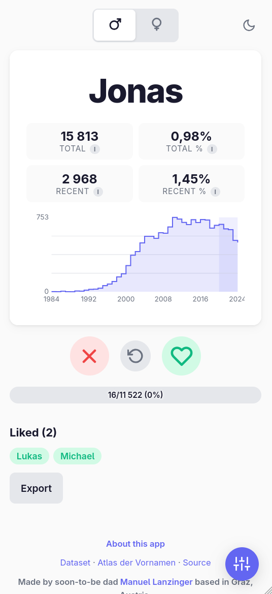
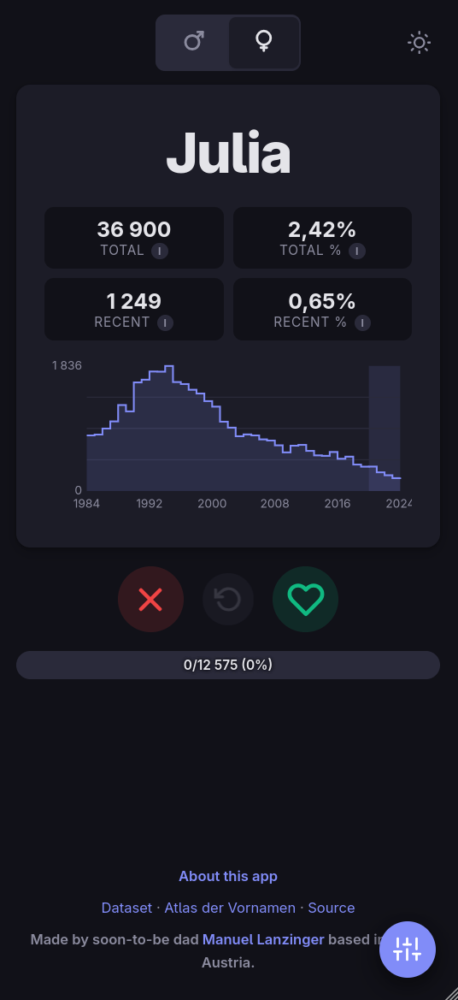
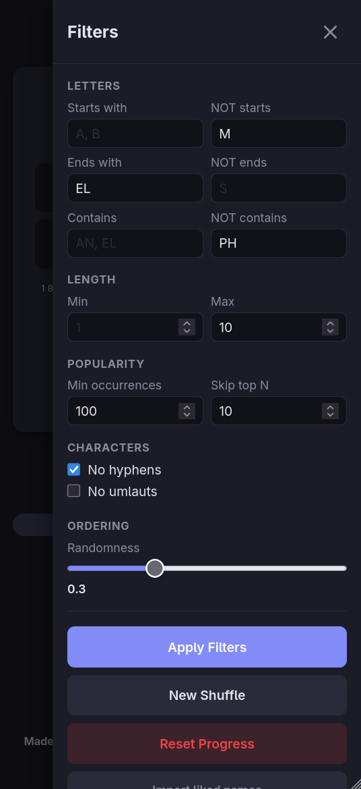

# Namerl

Yet another baby name matching app, but based on actual Austrian baby name data, packaged into a free and easy to use static website without adds or tracking.

**[→ Live app](https://namen.lanzinger.space/)**


## Screenshots

<table>
  <tr>
    <td></td>
    <td></td>
    <td></td>
  </tr>
</table>

## Data

Uses open data from [Statistik Austria](https://data.statistik.gv.at/data/OGDEXT_VORNAMEN_1.csv) via [data.gv.at](https://www.data.gv.at/datasets/603066f6-0f0a-3806-b394-f14b7d2cb437). Updated automatically via GitHub Actions once new data arrives (hopefully soon).

## Development

```bash
uv sync
uv run python data_processing.py
uv run python -m http.server 8000 --directory docs
```

### Tests & linting

```bash
uv run pytest tests/
uv run ruff check
uv run ruff format
uv run mypy data_processing.py
node tests/test_filters.js
```
